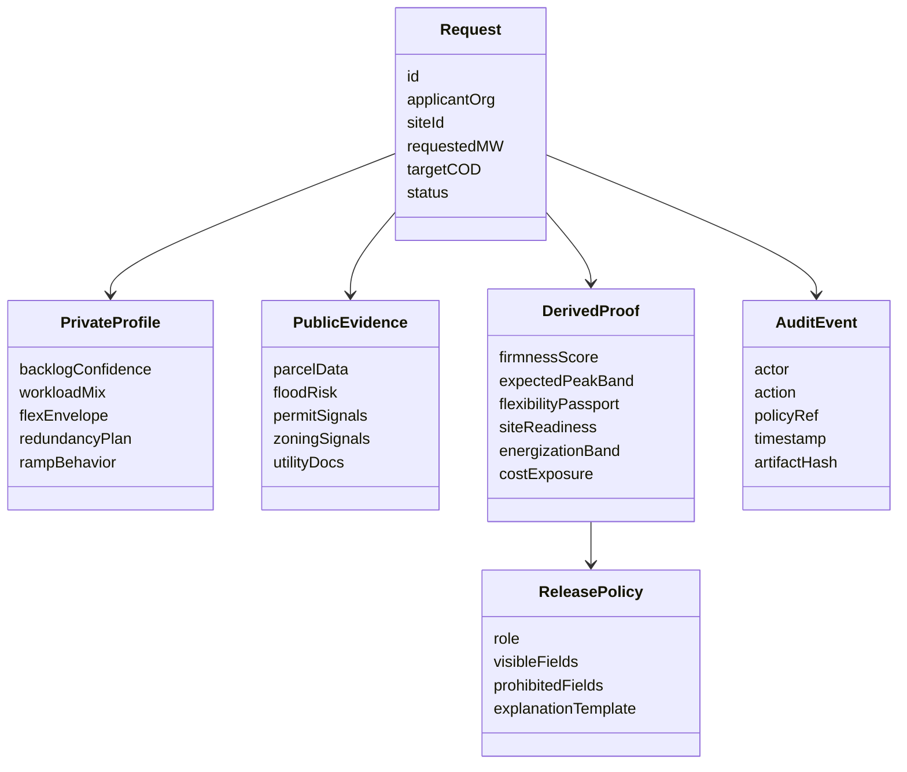

# 01 — Product Spec

## Product thesis

**Grid Passport** is a **confidential interconnection and flexibility workflow** for large electric loads.

It is not:
- a generic AI copilot
- a chat wrapper
- a utility dashboard
- a data clean room sold as a product

It is:

> a workflow system that converts **private, high-value raw information** into **policy-approved, role-specific proofs** so multiple stakeholders can plan together without raw data leakage.

## Problem-first framing

### The pain

Large load growth from AI and data centers is creating a queue problem, a forecasting problem, and a trust problem at the same time.

Utilities need answers to questions like:
- Is this load request real or speculative?
- How much of this load is likely to show up, and when?
- What site constraints or permitting friction will delay it?
- How much backup power, BESS, islanding, or workload flexibility exists?
- How much cost and reliability exposure should the system take on?

Applicants may know the answers, but those answers are often:
- competitively sensitive
- tied to internal model roadmaps
- operationally fragmented
- not safe or practical to disclose in raw form

### Why existing approaches fail

| Approach | Why people try it | Why it fails |
|---|---|---|
| Bigger forms | More information should improve decisions | Creates oversharing pressure and worse completion rates |
| NDAs + humans | Trusted bilateral process | Slow, expensive, inconsistent, non-scalable |
| Blanket deposits/collateral | Forces seriousness | Penalizes good actors and still doesn’t improve forecast quality |
| Manual spreadsheets | Familiar | No policy enforcement, no auditability, no reuse |
| Pure optimization engine | Sounds advanced | Garbage-in-garbage-out when the trust bottleneck remains |
| Chatbot only | Feels modern | Not enough structure, not credible for utilities/regulators |

### The correct approach

The right answer is not “share everything.”  
The right answer is not “share nothing.”

The right answer is:

1. collect the right raw inputs,
2. keep them in a confidential boundary,
3. compute derived outputs,
4. expose only the minimum role-appropriate proofs,
5. preserve a full audit trail.

That is the product.

---

## Target users

### 1) Applicant / hyperscaler energy lead
**Job to be done:**  
“Help me submit a load request that is taken seriously without forcing me to reveal my entire internal roadmap.”

**Their fears:**
- exposing commercial roadmap
- revealing workload details
- getting boxed into commitments too early
- losing negotiating leverage
- getting rejected because the form is confusing

### 2) Utility large-load origination / planner
**Job to be done:**  
“Help me separate signal from noise and produce a planning-quality view of this request.”

**Their fears:**
- speculative requests polluting the queue
- overbuilding around fake demand
- underplanning around real demand
- regulators asking why costs were assigned poorly
- customer disputes with no traceable rationale

### 3) Regulator / commission / reliability reviewer
**Job to be done:**  
“Help me verify fairness, cost causation, and process integrity.”

**Their fears:**
- cost shifting
- inconsistent queue treatment
- unreproducible decisions
- hidden special treatment
- reliability claims with no evidence

### 4) Data-center operations / flexibility manager (stretch product)
**Job to be done:**  
“Help me coordinate flexible load during grid stress without exposing raw workload secrets.”

---

## Product principles

1. **Policy beats prompt.**  
   Access control and disclosure rules must be explicit and inspectable.

2. **Derived proofs beat raw disclosure.**  
   Show what the other side needs to know, not everything you have.

3. **Structure beats chat.**  
   Use agents inside workflows, not as the only UI.

4. **Dual-view design is mandatory.**  
   Every important object should have at least two views: applicant and utility.

5. **Explainability must be role-specific.**  
   The applicant gets next steps.  
   The utility gets planning rationale.  
   The regulator gets process evidence.

6. **Fun comes from sharpness, not silliness.**

---

## Product surfaces

### Surface A — Applicant intake
TurboTax-style guided interview with:
- document upload
- public auto-fill
- field-by-field privacy classification
- live readiness meter
- live “what becomes visible to the utility” preview

### Surface B — Confidential vault
Visible in demo as a trust layer:
- sealed raw inputs
- attestation / release manifest
- policy engine decisions
- signed proof generation
- audit trail

### Surface C — Utility planning workspace
Decision-oriented:
- queue credibility
- forecast-adjusted expected MW
- flexibility passport
- energization band
- site/permitting risks
- scenario deltas
- recommended next actions

### Surface D — Regulator / audit mode
Evidence-oriented:
- what data classes were submitted
- what stayed hidden
- what derived outputs were released
- what policy allowed each release
- what public evidence influenced the result

### Surface E — Live stress event (stretch)
A single bounded operational scenario:
- grid stress event arrives
- system proposes a flex plan
- utility sees MW / duration / confidence
- applicant sees QoS / SLA / disruption class
- no one sees the other party’s raw secret state

---

## AI agent roster

Keep the agent system small and legible.

### 1) Cartographer
**Role:** public evidence agent  
**Inputs:** address, parcel ID, uploaded site docs  
**Outputs:** parcel context, flood / FEMA overlay, permit precedents, DEQ/SCC references  
**Why it matters:** proves AI can do real diligence work, not just summarize text

### 2) Interviewer
**Role:** guided intake agent  
**Inputs:** applicant answers, uploaded PDFs  
**Outputs:** structured request object, missing-field prompts, contradictions  
**Why it matters:** reduces form friction and normalizes messy inputs

### 3) Notary
**Role:** confidential compute agent  
**Inputs:** raw private fields  
**Outputs:** derived proofs, attestation manifest, sealed evidence  
**Why it matters:** this is the moat and trust layer

### 4) Referee
**Role:** policy / release agent  
**Inputs:** user role, request state, policy bundle  
**Outputs:** what is visible, what is redacted, what explanation is shown  
**Why it matters:** prevents accidental leakage

### 5) Forecaster
**Role:** planning agent  
**Inputs:** public evidence + derived private proofs  
**Outputs:** firmness score, expected peak band, energization band, cost exposure  
**Why it matters:** turns intake into planning value

### 6) Switchboard
**Role:** stress-event agent (stretch)  
**Inputs:** flexibility envelope + event conditions  
**Outputs:** bounded advisory response plan  
**Why it matters:** shows roadmap from planning to operations

### 7) Explainer
**Role:** audience-facing explanation agent  
**Inputs:** non-secret artifacts  
**Outputs:** clear narrative for applicant / utility / regulator / judges  
**Why it matters:** makes the demo legible

---

## Core objects

---

## Screen-by-screen demo spec

### Screen 1 — Hero / “The grid has a secrecy problem”
**Purpose:** set the thesis in under 10 seconds

**Components**
- giant line: **A 500 MW request is not a forecast**
- subline: “Grid Passport turns private load plans into utility-usable proofs”
- animated split:
  - left = raw private answers
  - right = released proofs
- CTA: **Run the request**

**Success condition**
- viewer instantly understands this is not another dashboard

**Wow factor**
- sealed-envelope animation where raw fields go into the vault and only proofs come out

### Screen 2 — Applicant intake wizard
**Purpose:** show the pain is real and the UX is humane

**Sections**
- site basics
- timeline
- electrical characteristics
- backup power / BESS
- workload flexibility
- global failover / redundancy
- private roadmap confidence

**Required UI features**
- every field labeled as:
  - `public`
  - `private`
  - `derived`
- side panel: “Why we ask”
- side panel: “What the utility will see”

**Key interaction**
Applicant enters:
- requested MW
- target COD
- percent flexible workload
- backup power hours
- ability to shift work to redundant sites

**Wow factor**
- ghost preview instantly shows the utility version with raw fields gone

### Screen 3 — Public evidence panel
**Purpose:** prove the system is not just taking user claims at face value

**Components**
- map with parcel + FEMA / hazard / permitting overlays
- permits / DEQ side drawer
- interconnection requirement snippets
- evidence confidence badges

**Data to include in demo**
- Virginia parcel context
- FEMA flood layer or similar hazard layer
- DEQ data-center air permitting references
- Dominion large-load interconnection requirements snippets

**Wow factor**
- map layers animate in while Cartographer explains what changed the risk profile

### Screen 4 — Confidential vault / attestation pane
**Purpose:** make the privacy story tangible

**Components**
- raw inputs list (redacted)
- policy bundle name/version
- attestation status badge
- signed proof manifest
- “operator cannot inspect raw fields” explainer
- audit trail table

**Do not overcomplicate**
No cryptography lecture. Just show:
- sealed
- measured
- policy-bound
- logged

**Wow factor**
- one-click “show release diff”:
  - raw field: hidden
  - derived proof: visible
  - policy reason: shown

### Screen 5 — Utility planning workspace
**Purpose:** show the business value

**Primary cards**
- **Firmness score**
- **Expected peak band**
- **Flexibility passport**
- **Earliest energization band**
- **Site readiness**
- **Cost exposure / collateral recommendation**
- **Top three blockers**
- **Recommended next action**

**Success condition**
- utility user can answer:
  - is this real?
  - what should I plan for?
  - what can the applicant do next?

**Wow factor**
- a slider changes flexible workload from 5% to 25% and the energization band improves live

### Screen 6 — Regulator / audit mode
**Purpose:** prove fairness and process rigor

**Components**
- matrix of field classes by visibility
- reason codes for every disclosed proof
- cost causation notes
- process artifacts
- versioned policy bundle
- signed audit entries

**Wow factor**
- “show me everything the applicant did *not* reveal” counter
- “show me why the utility still got enough to act” explanation

### Screen 7 — Live stress event (stretch)
**Purpose:** hint at the second product without overcommitting

**Event story**
- transformer delivery delay or heat-driven grid stress
- utility asks for bounded flexibility
- system computes advisory plan from pre-authorized flex envelope
- utility gets MW / duration / confidence
- applicant gets workload impact class only

**Important**
Keep this **advisory**, not autonomous control.

---

## The single best demo flow

1. Start with a synthetic request from a hyperscaler  
2. Show private fields being entered  
3. Show public evidence gathered automatically  
4. Show the confidential boundary create derived proofs  
5. Switch to utility mode and show better planning output  
6. Toggle one variable  
7. Show how decision quality changes  
8. End in regulator mode with audit proof

If you can only do one thing well, do this.

---

## Data fields to include

### Applicant-entered private fields
- requested capacity MW
- ramp profile after reconnection
- percent of workload that can be deferred
- percent of workload that can shift to redundant sites
- latency sensitivity tier mix
- planned backup generation capacity
- BESS capacity and duration
- internal confidence on delivery schedule
- model training / inference mix
- campus build phasing

### Public / auto-ingested fields
- parcel identifier
- county / jurisdiction
- flood or hazard signals
- DEQ permitting signals
- nearby transmission / substation context (high level)
- permitting precedent references
- utility process references

### Derived proofs
- firmness score (0–100)
- readiness band (red/yellow/green)
- expected coincident peak band
- flexibility passport (MW, duration, response class)
- energization band
- cost exposure class
- blocker list

---

## Product moat

### 1) Confidential release layer
The moat is not “we also use AI.”  
The moat is **policy-governed transformation of private raw data into planning-grade proofs**.

### 2) Large-load ontology
You will encode a reusable schema for:
- site readiness
- firmness
- flexibility
- redundancy
- cost responsibility
- energization risk

### 3) Evidence + policy + workflow bundle
A competitor can copy a form.  
It is harder to copy:
- the public evidence graph
- the release policies
- the explanation system
- the eval suite
- the audit artifacts
- the utility/regulatory workflow integration

### 4) Expansion path
Once the intake / proof system exists, you can expand into:
- queue triage
- rate / collateral recommendation
- aggregated portfolio forecasting
- real-time flexibility coordination
- regulatory filings / evidence packet generation

---

## Visual language

### Palette
- graphite / off-black backgrounds
- utility blue or steel blue
- acid-lime for “proof released”
- amber for caution / queue risk
- muted paper white for forms and evidence cards

### Motifs
- contour maps
- permit stamps
- wireframe single-line diagrams
- sealed envelopes
- dossier tabs
- diff views

### Motion
- fields sealing into vault
- proofs materializing out of vault
- map overlays sweeping in
- redaction wipes
- scenario sliders with immediate visual delta

### Tone
**sharp, strange, competent**

Example microcopy:
- “Show the vault, not the secret.”
- “This answer stays sealed.”
- “Utility sees the proof, not the premise.”
- “What changed your energization band?”

---

## Non-goals

Do not:
- simulate a full utility backend
- imply perfect forecast accuracy
- claim cryptographic impossibility unless implemented
- build an agent that can arbitrarily exfiltrate data
- turn the whole experience into a chatbot

---

## Definition of a great prototype

A great prototype makes a judge think:

1. “Yes, this pain is real.”
2. “Yes, ordinary approaches really do fail here.”
3. “Yes, AI agents are actually useful in this workflow.”
4. “Yes, the privacy story is more than hand-waving.”
5. “Yes, this could become a startup.”
