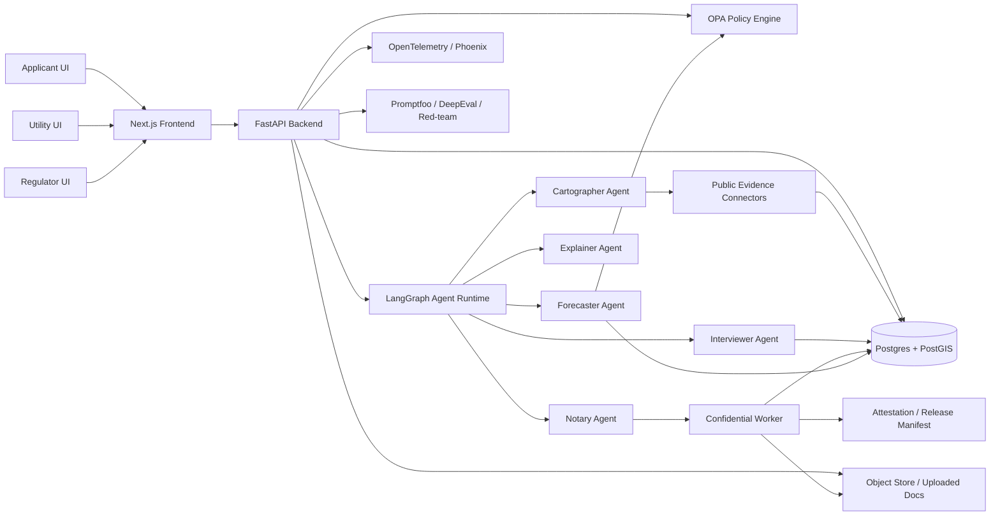

# 04 — Implementation Plan

## Executive recommendation

Build the prototype as a **local-first, policy-governed, confidential-workflow app** with a clean upgrade path to real confidential compute.

### Recommended stack for the hackathon
- **Frontend:** Next.js + React + TypeScript
- **Styling:** Tailwind CSS + a small custom design system
- **Map layer:** MapLibre GL JS
- **Backend / agent runtime:** FastAPI + LangGraph
- **Primary DB:** Postgres + PostGIS
- **Analytics / geospatial transforms:** DuckDB (spatial extension)
- **Policy engine:** Open Policy Agent (OPA / Rego)
- **Observability:** OpenTelemetry + Arize Phoenix (self-hosted)
- **Evals:** Promptfoo + DeepEval
- **Confidential compute (best production path):** Google Cloud Confidential Space
- **Optional alternative:** AWS Nitro Enclaves
- **Local dev / prototype mode:** Docker Compose with a simulated enclave boundary
- **Developer harness:** Claude Code + MCP + project subagents + hooks

This stack gives you:
- fast prototyping
- strong demo surfaces
- credible privacy architecture
- open standards
- minimal dead-end choices

---

## System architecture



---

## Why this architecture is right

The problem is not “run one model on one blob of text.”  
The problem is:
- structured intake
- messy document parsing
- public evidence gathering
- privacy-preserving transformation
- role-based disclosure
- planning scenario generation
- explanation and audit

That means you want:
- a durable workflow engine
- explicit policy boundaries
- a real database
- a real map layer
- a visible trust story

---

## Agent runtime recommendation

### Choose: LangGraph
Why:
- durable execution
- stateful workflows
- human-in-the-loop support
- production-ready deployment path
- good fit with Python tooling and eval stack

Use LangGraph for orchestration between:
- intake
- evidence lookup
- confidential proof generation
- planning output generation
- role-specific explanation

Do **not** create a huge swarm of autonomous agents.

---

## Tool integration recommendation

### Choose: MCP as the tool interface standard
Use MCP for:
- Postgres access
- local filesystem access
- maybe a custom permit / parcel / evidence server
- optional internal policy sandbox server

Why:
- open protocol
- growing ecosystem
- Claude Code supports it directly
- avoids brittle hand-rolled tool wrappers

### Ideal MCP servers for this project
- `postgres` — query request objects, policy tables, evidence tables
- `filesystem` — read/write local docs and fixtures
- `grid-evidence` (custom) — fetch parcel, FEMA, DEQ, SCC, Dominion snippets
- `policy-sim` (custom) — ask “what will this role be allowed to see?”

---

## Privacy-preserving infrastructure: what to use

For **interactive, multi-step agent workflows**, the best near-term privacy primitive is **confidential computing / TEEs**, not FHE, not differential privacy, not MPC as the primary engine.

Why:
- you need general-purpose compute
- you need document parsing, policy evaluation, geospatial joins, and transformation logic
- you need something demoable and production-plausible
- you need role-specific outputs, not just aggregate statistics

### What to use first
**Google Cloud Confidential Space** is the best production-aligned choice.

Why it fits:
- built for sensitive data from multiple parties
- designed so data owners can keep data confidential
- the operator cannot access data being processed
- workload release is tied to attestation
- pairs well with split-trust key handling (STET)

### Second-best option
**AWS Nitro Enclaves** is the strongest alternative if:
- your team is already AWS-native
- you want a more custom enclave service
- you are willing to do more plumbing

Nitro is excellent, but the developer ergonomics for a clean room / multi-party workflow are less direct.

### Do not choose as primary
**Azure AKS Confidential Containers** should not be your lead option because the preview is sunsetting and creates unnecessary story risk. Azure Confidential VMs remain relevant, but not the cleanest primary path for the demo.

---

## Privacy tech decision matrix

| PET / approach | Best use here? | Why | Why not first |
|---|---:|---|---|
| **TEE / confidential compute** | **Yes** | General-purpose secure processing, attestation, policy-gated outputs | Requires cloud setup and careful architecture |
| Differential privacy | Later | Great for aggregate analytics and benchmarking | Not suited for single-request planning decisions |
| FHE | Later / niche | Good for narrow encrypted numerical computation | Too heavy and awkward for document-heavy interactive workflows |
| MPC | Later / niche | Good when data absolutely cannot move across orgs | Operationally complex, poor fit for hackathon UX |
| Federated learning / analytics | Later | Good for cross-institution benchmarking | Doesn’t directly solve interactive request workflow |
| Plain encryption at rest | Not enough | Baseline hygiene | Does not protect data in use or operator access |
| “Trust us” SaaS | No | Easy | Not credible |

### Honest strategy
Lead with **TEE + policy-as-code**.  
Add:
- **Differential privacy** later for aggregated portfolio reporting
- **FHE / MPC** later for specific cross-party numeric analyses

---

## Cloud choice recommendation

### Primary path: GCP
Use GCP if you can get it working in time.

Why:
- Confidential Space directly fits the “multiple parties, mutually agreed workload” story
- STET strengthens the “even cloud insiders don’t get the key” narrative
- the product story is cleaner and easier to explain

### Suggested deployment split
- Frontend + API: local / Vercel / Cloud Run
- Confidential worker: GCP Confidential Space
- Object storage: GCS
- DB: Neon/Postgres or Cloud SQL/Postgres
- Traces: self-host Phoenix

### Secondary path: AWS
Use AWS if:
- you already know it better
- you want to ship faster on infra you understand
- you can tolerate a more custom enclave story

### Suggested deployment split
- Frontend: Vercel / local
- API + agents: ECS/Fargate or EC2
- Confidential worker: Nitro Enclave
- Storage: S3
- DB: RDS/Postgres

---

## Local-first prototype strategy

Do **not** block the hackathon on enclave deployment.

### Build two modes

#### Mode A — `demoMode`
- runs locally
- simulates the confidential boundary
- produces a fake-but-plausible attestation artifact
- enforces real release policies

#### Mode B — `secureMode`
- swaps the notary/proof step to a real confidential worker
- same request object
- same UI
- same policy bundle
- same audit trail shape

This lets you:
- demo the workflow even if enclave deployment slips
- remain honest about what is simulated vs real
- keep the product structure stable

Rule: the UI should never depend on the cloud provider. Only the `Notary` implementation should swap.

---

## Policy layer

### Choose: OPA / Rego
Why:
- explicit policy-as-code
- open source
- proven in infra and Kubernetes contexts
- easy to explain
- good fit for release decisions

### Use OPA for
- field visibility rules
- derived-proof release rules
- allowed role actions
- “can model X see raw field Y?” rules
- audit reason codes

### Example policy classes
- applicant can view raw own-submitted fields
- utility can view derived proofs, not raw private fields
- regulator can view visibility matrix and policy reason codes
- explanation agent can only access non-secret artifacts
- traces/logs may never store protected field values

---

## Data layer

### Primary database: Postgres + PostGIS
Use Postgres for:
- request objects
- policy bundles
- release manifests
- audit events
- case studies
- user role state

Use PostGIS for:
- parcel geometry
- buffers
- spatial joins
- hazard overlays

### Secondary analytics layer: DuckDB
Use DuckDB for:
- offline scenario computation
- CSV / Parquet ingestion
- rapid geospatial transforms
- local notebooks / reproducible analyses

This is a strong combo:
- Postgres/PostGIS for serving the app
- DuckDB for fast local analysis and fixture generation

---

## Mapping stack

### Choose
- MapLibre GL JS
- PMTiles or hosted vector tiles if convenient
- simple GeoJSON overlays first

Why:
- open source
- production-feeling maps
- no dependence on proprietary map stack
- fits the infrastructure-grade taste

### Minimum viable map layers
- parcel / site polygon
- flood / hazard overlay
- jurisdiction boundary
- simple substation / transmission context (high level)

---

## Frontend recommendation

### Choose: Next.js + React + TypeScript
Why:
- fast UI iteration
- easy routing for `/`, `/demo`, `/case-files`, `/trust`
- good DX with Claude Code
- strong demo polish potential

### UI composition
- avoid a card-grid SaaS look
- use a split-pane dossier layout
- strong role switcher
- visible side panels for evidence and audit
- one main object at a time

---

## Model strategy

Use **two model zones**.

### Zone 1 — sensitive zone
Inside the confidential boundary or local protected service:
- deterministic validators
- structured extraction
- optional compact local model for parsing / normalization

### Zone 2 — sanitized zone
Outside the confidential boundary:
- frontier model for explanation / UX polish / role-specific copy
- only receives sanitized, policy-approved derived fields

### Why this split is strong
- raw private data does not need to hit the external model
- the external model still gives excellent UX and explanation quality
- the privacy claim remains credible

For the prototype:
- keep the sensitive zone mostly deterministic + rule-based
- use a model sparingly for normalization
- let the sanitized zone do more narrative work

Do not over-index on model cleverness. The moat is the release layer.

---

## Observability recommendation

### Choose: OpenTelemetry + Phoenix
Why:
- open standards
- no vendor lock-in
- good fit for agent traces
- useful during debugging

### What to trace
- agent start/end
- tool calls
- policy evaluations
- release-manifest creation
- derived-proof generation
- redactions applied
- user-visible decisions
- latency by stage

### Critical logging rule
Never log raw protected fields. Log only:
- field classes
- hashes
- counts
- reason codes
- artifact IDs

---

## Evaluation stack

Choose:
- **Promptfoo** for regression, red-team, CI-friendly checks
- **DeepEval** for unit-test-like LLM/app metrics
- **Phoenix / traces** for failure analysis

Why:
- Promptfoo is strong for local, private, CLI-driven evals and red teaming
- DeepEval is strong for structured metrics and component-level testing
- traces are how you actually discover what broke

---

## Supply-chain / production-intentional hardening

You do not need full enterprise security for the hackathon, but a few visible choices help.

Recommended:
- build container images deterministically where possible
- sign images with Cosign
- emit provenance / SLSA metadata if practical
- verify image signatures on deployment if using Kubernetes later
- version policy bundles
- version prompts and tool definitions in git

---

## Proposed repo structure

```text
grid-passport/
├─ apps/
│  ├─ web/                      # Next.js frontend
│  └─ api/                      # FastAPI backend
├─ packages/
│  ├─ agents/                   # LangGraph workflows
│  ├─ policy/                   # OPA/Rego policies
│  ├─ shared-types/             # TS + Python schema sync
│  ├─ ui/                       # design system components
│  └─ evals/                    # promptfoo + deepeval configs
├─ data/
│  ├─ fixtures/
│  ├─ case-studies/
│  └─ public-layers/
├─ infra/
│  ├─ docker/
│  ├─ terraform/                # optional
│  └─ confidential-worker/
├─ .claude/
│  ├─ agents/
│  └─ skills/
├─ CLAUDE.md
└─ README.md
```

---

## API shape

### `POST /requests`
Create a new request.

### `POST /requests/:id/intake/answer`
Append or update structured applicant answers.

### `POST /requests/:id/evidence/refresh`
Run Cartographer and update public evidence.

### `POST /requests/:id/proofs/generate`
Run Notary + Forecaster and create derived proofs.

### `GET /requests/:id/view?role=applicant|utility|regulator`
Render the role-specific projection.

### `POST /requests/:id/scenario`
Run a counterfactual scenario.

### `GET /requests/:id/audit`
Return audit events and release manifest.

### `POST /events/:id/advisory`
Stretch: compute a bounded flexibility response plan.

---

## Suggested schema fragments

### `requests`
- `id`
- `org_name`
- `site_name`
- `requested_mw`
- `target_cod`
- `status`
- `created_at`

### `private_profiles`
- `request_id`
- `flex_percent`
- `redundancy_shift_percent`
- `training_inference_mix`
- `ramp_profile_json`
- `internal_confidence`
- `backup_power_kw`
- `bess_kw`
- `bess_hours`

### `public_evidence`
- `request_id`
- `flood_risk_class`
- `permit_risk_class`
- `zoning_risk_class`
- `notes_json`
- `source_refs_json`

### `derived_proofs`
- `request_id`
- `firmness_score`
- `expected_peak_min_mw`
- `expected_peak_max_mw`
- `flex_mw`
- `flex_duration_hours`
- `site_readiness_class`
- `energization_band`
- `cost_exposure_class`
- `generated_from_policy_version`

### `audit_events`
- `id`
- `request_id`
- `actor_type`
- `action`
- `artifact_hash`
- `policy_version`
- `details_json`
- `created_at`

---

## Build phases

### Phase 0 — One evening
- static landing page
- fake case study data
- dual-view toggle
- manual role-based redaction
- no backend sophistication yet

### Phase 1 — First real prototype
- structured intake wizard
- real request object
- public evidence side panel
- OPA-backed visibility decisions
- derived-proof cards
- audit table

### Phase 2 — Strong hackathon demo
- counterfactual scenario slider
- Phoenix traces
- promptfoo evals
- fake or real attestation artifact
- regulator mode

### Phase 3 — Stretch
- real Confidential Space or Nitro worker
- signed release manifest
- event advisory scenario
- multiple case study selector

---

## What not to overbuild

- auth
- billing
- real enterprise integrations
- a broad GIS platform
- autonomous control logic
- any feature not directly visible in the demo or eval harness

---

## Honest limitations to state if asked

- initial proof models are heuristic / rules + structured reasoning, not ground-truth forecasts
- confidential compute may be demoed in simulated mode if the real worker is not deployed
- public data connectors are first-pass and Virginia-focused
- operational flexibility is advisory only in v1

These limitations make you sound serious, not weak.

---

## The final implementation mantra

**Build the boundary, not the buzzword.**

If you get these five things right, the prototype will feel unusually strong:
1. dual-view request object
2. policy-governed visibility
3. public evidence gathering
4. one convincing proof transformation
5. counterfactual scenario improvement
